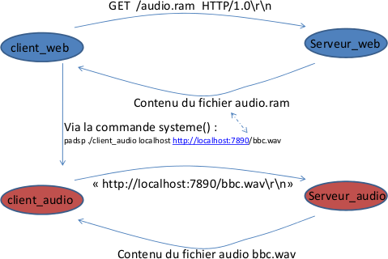

streaming_diffusion
===

- [Introduction](#introduction)
- [ConversionMP3-WAV](#conversionmp3-wav)
- [DefinitionRDF](#definitionrdf)
- [MetadonneesWAV](#metadonneeswav)
- [Upload](#upload)
- [IndexationZendLucene](#indexationzendlucene)
- [StreamingWAV](#streamingwav)

## Introduction

L'objectif du projet est de créer un service permettant d'**écouter en diffusion progressive des fichiers musicaux**. Le client pourra choisir ces morceaux grâce à moteur de recherche qui indexera les métadonnées contenues dans les fichiers musicaux.

Nous récupérons quelques musiques libre de droit sur le site [musicscreen](http://www.musicscreen.be).

Nous utiliseront le langage **Python** afin de réaliser le projet.

## ConversionMP3-WAV

Nous avons récupérer 3 fichiers musicaux dans la catégorie Piano: 

	- Luiz

	- Hilouine

	- GypsyPno 

Pour les convertir en WAV nous avons utilisés un site en ligne : [audio.online-convert](http://audio.online-convert.com/fr/convertir-en-wav).

Nous avons regroupé les musiques dans le dossier **web/uploads**.

Un fichier **WAV** se compose d’un entête qui contient pas mal de meta données. Cet entête a été optimisé pour prendre peu de place.

## DefinitionRDF

Nous avons définit les **données importantes** pour les musiques : 
	
	- Title

	- Description

	- Time

	- Tags

Pour réaliser les méta-données RDF, on a préféré le construire en **N3** et le **convertir en RDF** et ensuite le visualiser par un validateur RDF.

Le fichier RDF est : base_audio.rdfs

Le fichier N3 est : base.n3

Adresse : 
	
- Conversion : [RDF-Translator](http://rdf-translator.appspot.com/)

- Validateur : [W3](http://www.w3.org/RDF/Validator/)

On peut observer les différents noeuds RDF sur le site W3 en choisissant l'option **Graph** 

## MetadonneesWAV

Nous allons maintenant travailler sur les méta-données en format RDF pour chaque fichier son et les insérer dans les fichiers WAV correspondant.
On utilisera la bibliothèque [Python_XMP_Toolkit](https://code.google.com/p/python-xmp-toolkit/) pour ajouter au format XMP les méta-données dans les fichier WAV.

Nous avons mit les schemas RDF de chaque musique dans le dossier **Description**.

Nous avons automatisé l'ajout des meta données :

```
fileListWAV=os.listdir("./uploads/");
for f in fileListWAV :
	name=f.split('.', 1 )[0];
	# Read file
	xmpfile = XMPFiles( file_path="./uploads/"+name+".wav", open_forupdate=True );
	# Get XMP from file.
	xmp = xmpfile.get_xmp();
	# Create Meta donnees
	meta = libxmp.XMPMeta();
	fic = open('./Description/'+name+'.rdf');
	meta.parse_from_str(fic.read(), xmpmeta_wrap=False, input_encoding=None);
	print 'file could be updated = ', xmpfile.can_put_xmp(meta);
	xmpfile.put_xmp(meta);
	xmpfile.close_file(close_flags=1);
```

- On récupère dans une liste tout les fichiers du dossier **uploads/**.

- On parse le fichier pour récupérer que le nom.

- On lit le fichier.

- On récupère les meta données.

- On créait notre méta données en prenant le fichier description RDF associé.

(le fichier WAV et le fichier RDF doit être du même nom ).

- On l'enregistre dans le fichier WAV puis on ferme le fichier.


Afin de récupérer les métadonnées contenues dans le fichier wav précédemment insérée on a également utilisé la bibliothèque [Python_XMP_Toolkit](https://code.google.com/p/python-xmp-toolkit/), c'est le fichier xmpParse.py:

```
print sys.argv[1];
xmpfile = XMPFiles( file_path="./uploads/"+sys.argv[1], open_forupdate=False )

xmp = xmpfile.get_xmp();
print xmp.get_localized_text( libxmp.consts.XMP_NS_DC, 'title', 'fr', 'fr-FR');

count = xmp.count_array_items( libxmp.consts.XMP_NS_DC, 'subject');
for i in range(1, count+1):
	print xmp.get_array_item( libxmp.consts.XMP_NS_DC, 'subject', i).keys()[0];
```

## Upload

Nous avons trouvé un premier projet [git](https://github.com/blueimp/jQuery-File-Upload/wiki/Setup) que l'on a voulu intégré au notre pour gérer l'upload de fichier. Seulement le projet étant conséquant, il nous a été trop du de finir l'intégration dans les délais. Une version de cette interface est encore présente dans la branche master/

La deuxième interface retenue, également un projet [git](https://github.com/nervgh/angular-file-upload) nous a posé moins de soucis pour l'intégration.

## IndexationZendLucene

L'indexation se décompose en deux étapes :
- Création d'un index
- Ajout d'un document à un index existant

Ensuite on a l'optimisation de l'index (non implémenté ici) et la recherche.

Nous avons décidé de décomposer chaque action dans un fichier php distinct.

Voici la création de l'index :
```
$exists = false;
try {
	\ZendSearch\Lucene\Lucene::open($argv[1]); 
	$exists = true;
} catch (Exception $e) {
	$index = \ZendSearch\Lucene\Lucene::create($argv[1]);
	print "index " . $argv[1] . " créé" . PHP_EOL;
}

if($exists) {
	throw new Exception("L'index " . $argv[1] . " existe déjà" . PHP_EOL, 1);
}
```

L'ajout d'un document se décompose en trois phases, l'appel au fichier index-add :
```
$extensionsValide = ['wav'];

// Vérification si l'index existe
try {
	$index = \ZendSearch\Lucene\Lucene::open($indexName); 
} catch (Exception $e) {
	throw new Exception("L'index " . $indexName . " n'existe pas " , 1);
}

$tabDocumentName = explode('.', $documentName);
$extension = $tabDocumentName[count($tabDocumentName)-1];

// Vérifie si l'extension du document est valide
if(!in_array($extension, $extensionsValide)) {
	throw new Exception("L'extension du document n'est pas valide", 1);
}

// Vérifie si le fichier existe
if(!file_exists("./uploads/".$documentName)) {
	throw new Exception("Le fichier " . $documentName . " n'existe pas", 1);
}

// Création du document à partir du document fourni et ajout dans l'index
switch($extension) {
	case 'wav':	$doc = new \ZendSearch\Lucene\Document;
			wavProcess($index, $doc, $documentName);
				break;
}

if($doc) {
	$index->addDocument($doc);
}
```

Puis l'appel au fichier wavProcess, qui appel le fichier python xmpParse.py pour récupérer les métadonnées et les ajouter ensuite au document et à l'index:
```
<?php
function wavProcess($index, $doc, $documentName) {

	$fileName = explode('.',$documentName)[0];
	$fileNameField = \ZendSearch\Lucene\Document\Field::text(
		'filename',
		$fileName
	);
	
	//APPEL DU FICHIER PYTHON
	exec('python ./xmpParse.py '.$documentName,$res, $retcode);

	// Title	
	$title = $res[0];
	$titleField = \ZendSearch\Lucene\Document\Field::text(
		'title',
		$title
	);

	// echo "Title : " . $title[0] . PHP_EOL;

	// Subject
	for ($i = 1; $i < count($res); $i++) {
		$subject = $res[$i];
		$subjectField = \ZendSearch\Lucene\Document\Field::text(
			$subject,
			$subject
		);
		$doc->addField($subjectField);
	}

	// echo "Subject : " . $subject[0] . PHP_EOL;


	$doc->addField($fileNameField);
	$doc->addField($titleField);
	$index->addDocument($doc);
}
```

La recherche s'effectue assez simplement ensuite à l'aide du fichier index-search.php qui est appelé lors de la recherche:
```
<?php
require_once "../vendor/autoload.php";
echo '<ul>';

	if(isset($_GET['search']))
	{ 
		$indexName = 'audio_index';
		$request = $_GET['search'];

		// Vérification si l'index existe
		try {
			$index = \ZendSearch\Lucene\Lucene::open($indexName); 
		} catch (Exception $e) {
			throw new Exception("L'index " . $indexName . " n'existe pas " , 1);
		}
		// Requête
		try {

			$query = \ZendSearch\Lucene\Search\QueryParser::parse($request);
			$find = $index->find($query);
			foreach($find as $hit) {
				echo $hit->title.' '.$hit->score;
				echo '<li><a href="./stream.php?name='.$hit->title.'">' . $hit->title . '</a></li>';	
			}


		} catch (Exception $e) {
			throw new Exception("Requete invalide : " . PHP_EOL . $e, 1);
		}
	}
	else {
		throw new Exception("Veuillez fournir un index existant et une requête de recherche valide", 1);
}
echo '</ul>';
?>
```

## StreamingWAV

En ce qui concerne le streaming de music, nous avons programmé un server et un client en langage C en local. On peut considérer que notre server propose un streaming virtual par l'intermédiaire du http.

Le serveur audio local écoute sur le port 7890 et si un client se connecte il renvoie la music choisit sur le site sous la forme d'un flux raw. Le Client audio local envoie une requête sur le port 7890 de localhost en GET par son nom WAV en HTTP/1/1\r\n

Le client recevra le flux de données au fur et à mesure sur les hauts-parleurs.




Pour tester vos HP (sortie casque) à partir d’un fichier wav à partir du terminal :

```
sox bbc.wav –t ossdsp /dev/dsp
```

Pour accéder au périphérique /dev/dsp, utilisez padsp. Il s’utilise en spécifiant en
paramètre la commande qui veut un accès au périphérique.

```
padsp ./web/Stream/client_audio localhost ./web/Stream/abc.wav
```

Sur notre sitre nous avons juste à choisit de le lancer en PHP : 

```
shell_exec("padsp ./Stream/client_audio localhost ../uploads/". $_GET['name']);
```
padsp est serveur de son PulseAudio.


Explication du fichier server_audio.c :

```
		     	buf[(2*bin)%LINELENGTH]=aby;
		     	buf[(2*bin+1)%LINELENGTH]=bby;
		     	if (bin!=0 && (2*bin)%LINELENGTH==0)
		        	send(new_sockfd,buf,LINELENGTH,0);
		  
		        }

```
- On remplit le buffer avec les données : 8 bits de poids faibles suivis des 8 autres : buf sera ensuite envoyé au HP ou sur le flux à destination du client

- L'astuce est de lire le flux de données : et d'envoyer les données par paquet de 1024 

(Il est donc inutile de réserver un buffer complet pour la lecture du fichier). 
		     		    


Explication du fichier client_audio.c :

```
send_string(sockfd, strcat(argv[2], "\r\n"));
while((n=fread(buf, sizeof(char), LINELENGTH, fdesc)))
{
	
	status = write(fdson, buf, LINELENGTH);
	if (status == -1)
		perror("SOUND_PCM_SYNC ioctl failed");
}
fclose(fd);
printf("Arret du serveur\n");
exit(1);

```
- On place dans le tableau buf le contenu d'un paquet reçu dans le  tampon de la socket fdesc.

- On écrit sur le flux fdson le contenu de buf pour l'envoie aux haut-parleurs.


